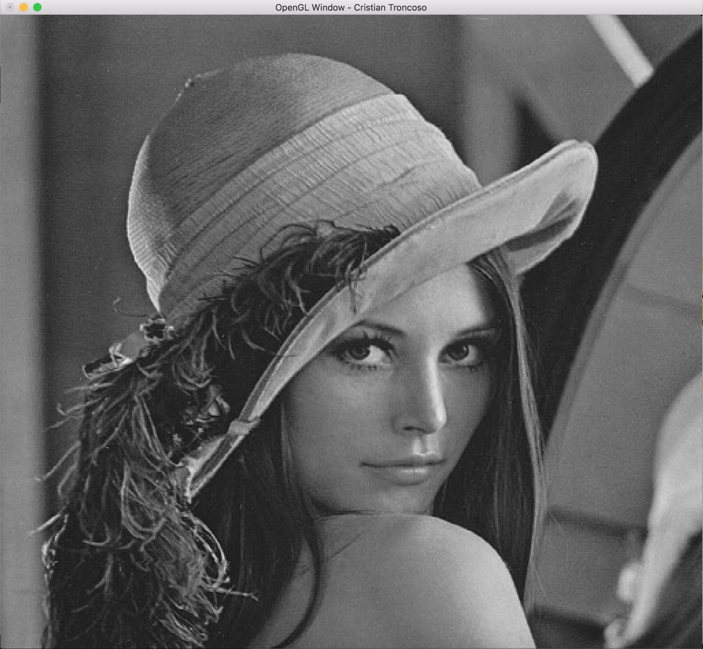

**OpenGL OpenCL interoperability**

This project loads a bitmap buffer to a kernel in order to processes it
and render it on the GPU.

Two techniques are used to achieve this goal, Render to Texture and GLCL
interoperability.

1.  Rendering to Texture consists on rendering a scene on a 2D texture
    that can be processed and displayed later. The scene is rendered to
    a texture using a framebuffer object in order to manipulate
    resulting data more easily. How come, a framebuffer is a collection
    of buffers that can be used as the destination for rendering. The
    default Framebuffer is provided by OpenGL Context, and it usually
    represents a window or display device. The user-created Framebuffer
    Object (FBO) references images from either Textures or
    Renderbuffers, they are never directly visible.

2.  OpenCL/OpenGL Texture Interoperability: The basic idea consists on
    the GPU executing OpenGL and rendering to a Texture, which becomes
    the “input texture”. Next, the GPU executes OpenCL treating the
    input and output textures as “image2d\_t data types”. Finally, GPU
    executes OpenGL by rendering the output texture from OpenCL onto a
    Quad primitive.

> The goal of this exercise is that I can implement on-the-fly image
> processing to picutures frames as they are being displayed by OpenGL
>
> 
