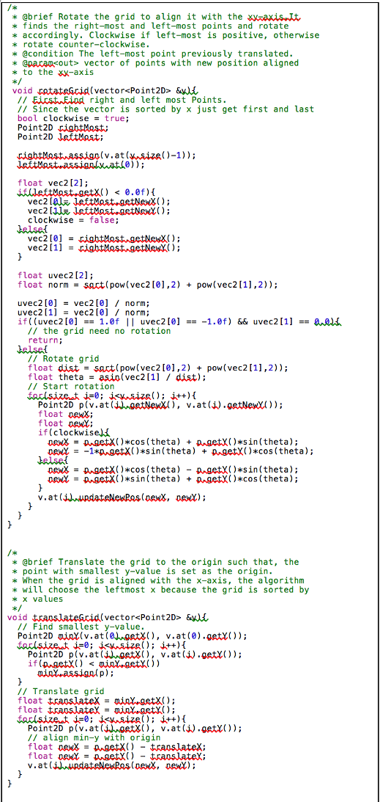
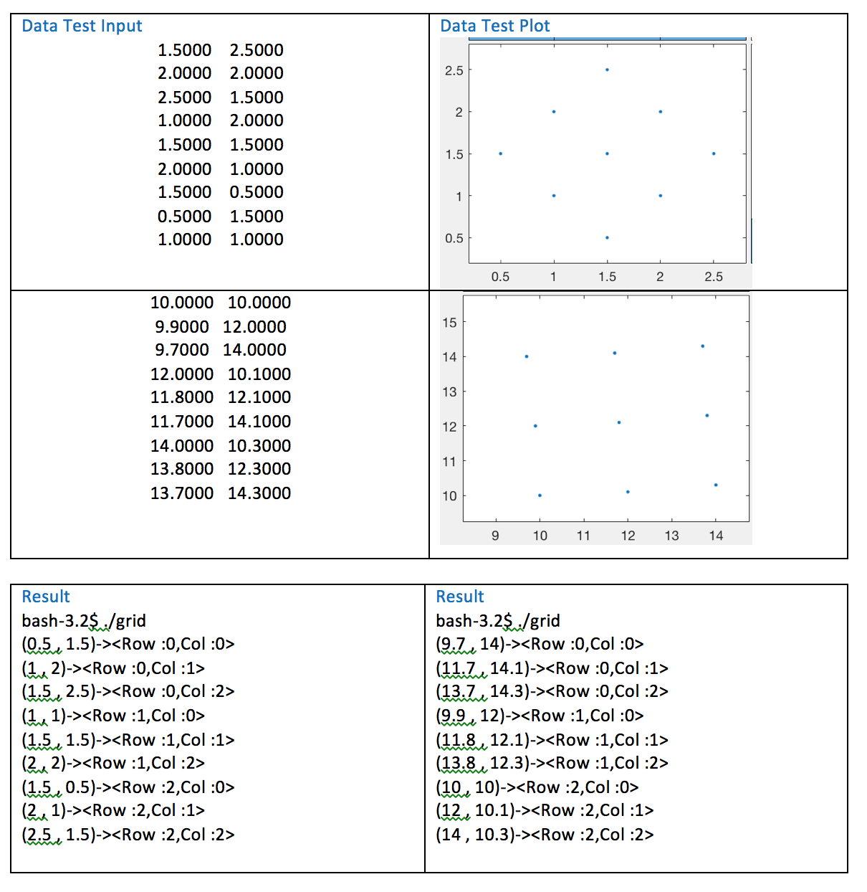

The Grid Problem
================

Cristian Troncoso

Definition
----------

Given a collection of 2D points, create an algorithm that classifies
each point into rows and columns.

Problem Specifications

-   Points form a grid in 2D space.

-   Input points are in no particular order.

-   The grid is square – there are the same number of rows as columns.

-   The grid is fully populated – there are no missing points.

-   The distance between two neighboring points in the same row or
    column is constant.

-   Columns and Rows may or may not be aligned with the x and y axes.

-   The number of columns and rows are arbitrary.

Algorithm

1.  Sort the data by increasing order of its x-component.

2.  Find the lowest y-value. If the data is tilted to either side, there will always be a lower corner. If the data is aligned with the x-axis, the lower corner will be the lowest y with the lowest x (because the data is sorted).

3.  Translate the grid to the origin such that the lowest point becomes the position (0,0).

4.  Rotate the Grid, either counter-clockwise or clockwise. This will depend on the quadrant the grid got translated to. If the grid is tilted left, it will be translated to the right quadrant. If the grid is tilted right it will be translated to the left quadrant. By this point the data is fully transformed into a new aligned grid.

5.  Sort transformed grid by its y-value, so the data will be grouped by rows

6.  Grab each group which represent a row and sort it by its transformed x-value and use it to create the Row and Columns objects.

Implementation
--------------

A Class Data was created to handle the data input; it can feed either data from memory or from a file.
A class Point2D was implemented to contain the information for each point; original position, transformed position and labels.
Finally, a class Row and Column were implemented to organize the points by row or by column.
The algorithm uses encapsulation by delegating the creation of Point2D objects to a factory class, Point2DFactory (Factory method pattern).
The most important functions are rotation, and translation, can be seen in the following listing.

Testing
-------
  

Input and Output
----------------

The following program reads a text file containing a set of tuples
representing 2D points and outputs a report to the standard console. It
also calculates the angle between any rows and the x-axis. Main logic is
listed in listing 2

  bash-3.2\$ ./grid test.txt
  
  Row 0: 10,14 - 12,14 - 14,14
  
  Row 1: 10,12 - 12,12 - 14,12
  
  Row 2: 10,10 - 12,10 - 14,10
  
  Col 0: 10,14 - 10,12 - 10,10
  
  Col 1: 12,14 - 12,12 - 12,10
  
  Col 2: 14,14 - 14,12 - 14,10
  
  Alpha=0 degrees
  
  bash-3.2\$ ./grid grid\_input.txt
  
  Row 0: 9.7,14 - 11.7,14.1 - 13.7,14.3
  
  Row 1: 9.9,12 - 11.8,12.1 - 13.8,12.3
  
  Row 2: 10,10 - 12,10.1 - 14,10.3
  
  Col 0: 9.7,14 - 9.9,12 - 10,10
  
  Col 1: 11.7,14.1 - 11.8,12.1 - 12,10.1
  
  Col 2: 13.7,14.3 - 13.8,12.3 - 14,10.3
  
  0.0748599
  
  Alpha=4.28916 degrees
  